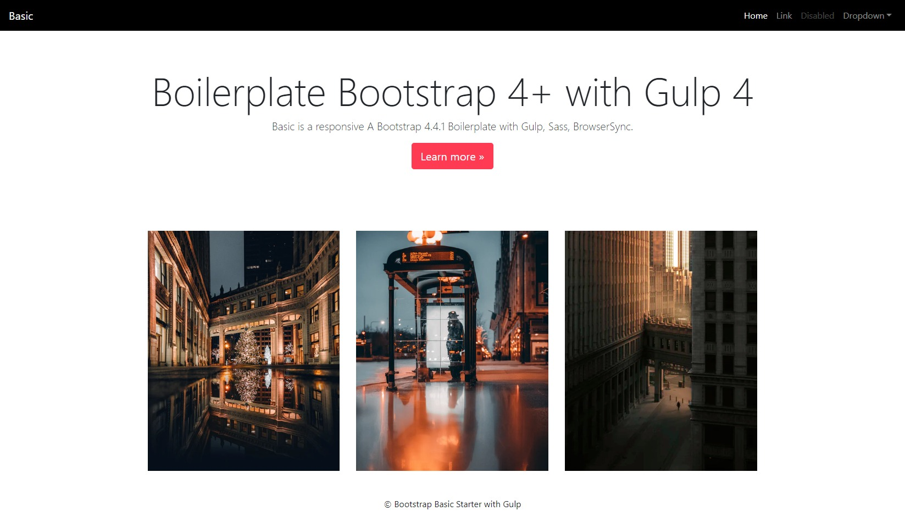

# Bootstrap 4.4.1 Boilerplate - Basic

This is a Bootstrap 4.4.1 Boilerplate with Gulp 4+. Sass, browser-sync.




<h4 align="center">This is the ultimate Bootstrap 4.4.1 starter for developers. A boilerplate with Gulp4, cross-env, Sass, sourcemaps, concat, CSS & HTML minification, uglify, image optimization, template partials, BrowserSync.</h4>

This is the ultimate Bootstrap 4.4.1 starter for developers. A boilerplate with Gulp4, cross-env, Sass, sourcemaps, concat, CSS & HTML minification, uglify, image optimization, template partials, BrowserSync.
Basic is a responsive A Bootstrap 4.4.1 Boilerplate with Gulp 4, compatible with Bootstrap 4.4.1.


## “Basic” is the ultimate Bootstrap 4.4.1 starter boilerplate with Gulp 4 for automation and rapid development.

* Bootstrap 4.4.1
* Gulp 4
* Sass
* sourcemaps
* concatenation
* CSS minification
* HTML minitification
* uglify
* image optimization
* template partials
* BroswserSync, live reload

## For developers
Download or clone the repository. After that, from the root of your download/clone:

```sh
$ git clone https://github.com/jay-nagar/Bootstrap-4-Boilerplate-w-Gulp-4.git
```
### Install

Install project dependencies:

```sh
$ npm install
```

If something goes wrong, delete the ```sh node_modules ``` folder and run ```sh npm install ``` again.

Now let’s make sure you also have Gulp installed globally:

```sh
$ npm install gulp -g
```

### Start Server

```sh
$ gulp serve
```

You should see a live browser at http://localhost:3000/.

### Development
##### Override Bootstrap’s variables and create your custom styles

``` src/scss/style.scss ```

This will be automatically compiled to ```src/css/styles.css```.

##### Add custom scripts

```src/js/index.js```

##### Partials

You can add partials in ```src/partials/```.

Insert partial : ```<partial src="header.html"></partial>```.

Examples are already added in this this project for ```header``` & ```footer```.

### Production

```sh
gulp 
``` 

If you want HTML, CSS minification & image optimization:

```sh
npm run prod
```

```Docs``` folder is the destination. You can now go ```docs/index.html``` and check the output.

## License

JAY  © [Jay Nagar](http://jaynagar.me)
